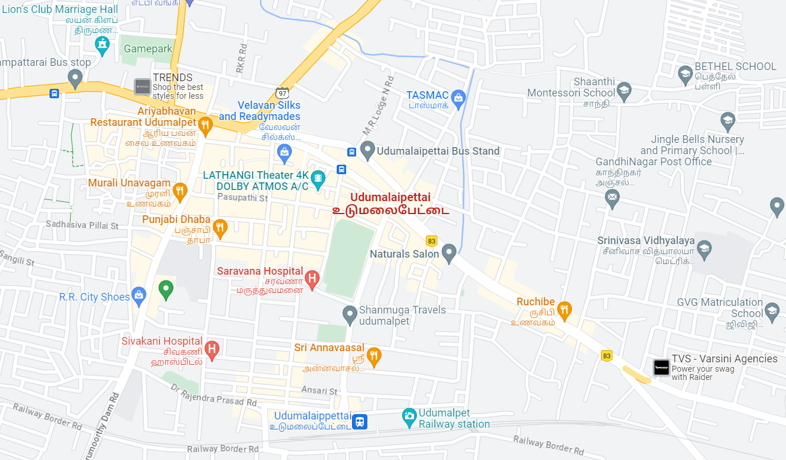
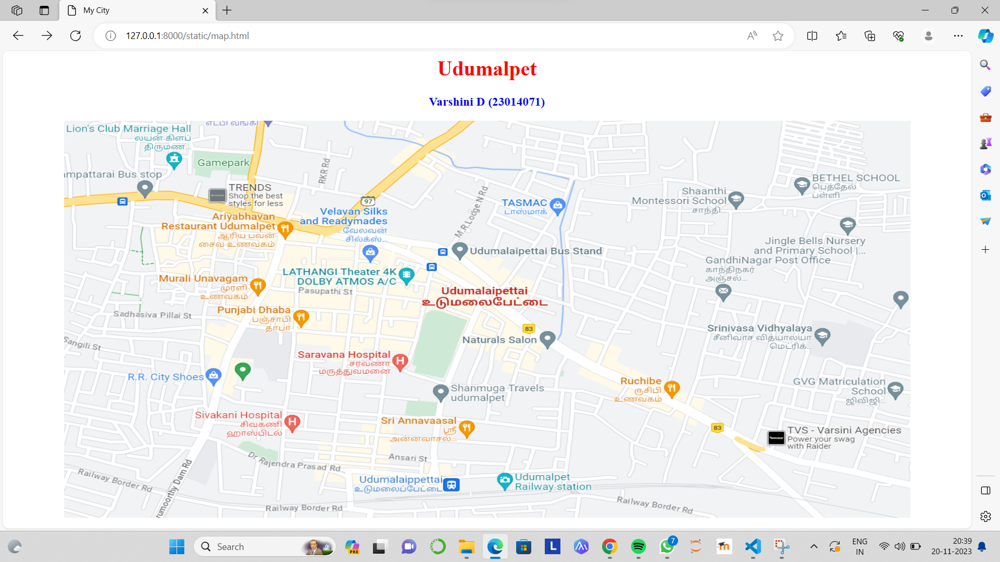
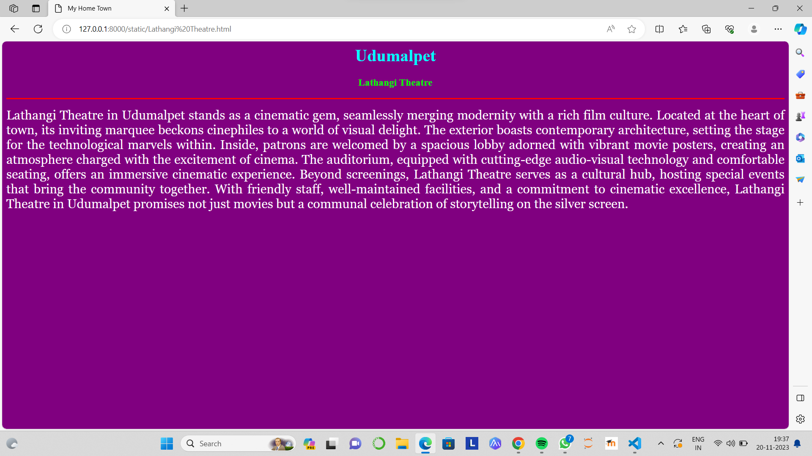
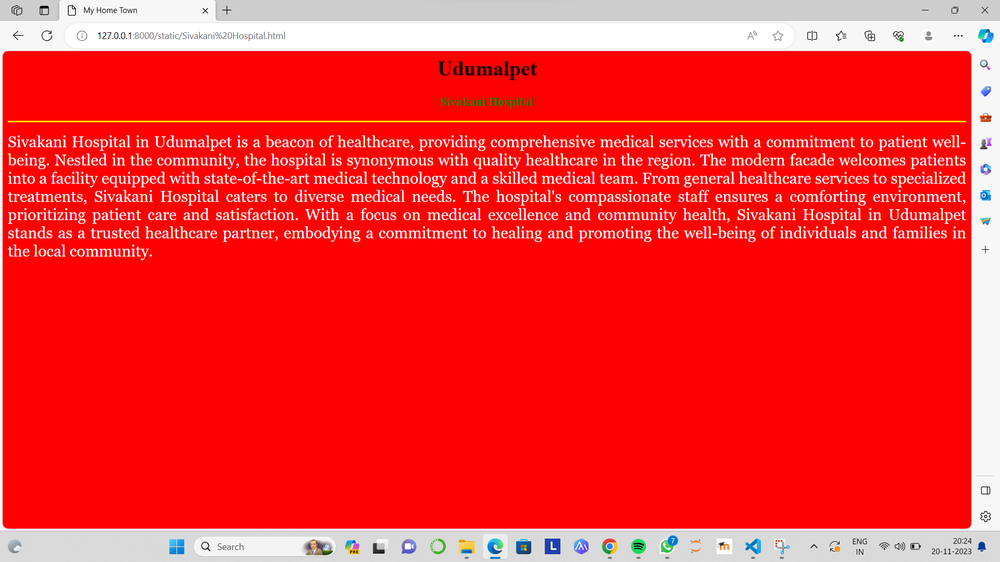
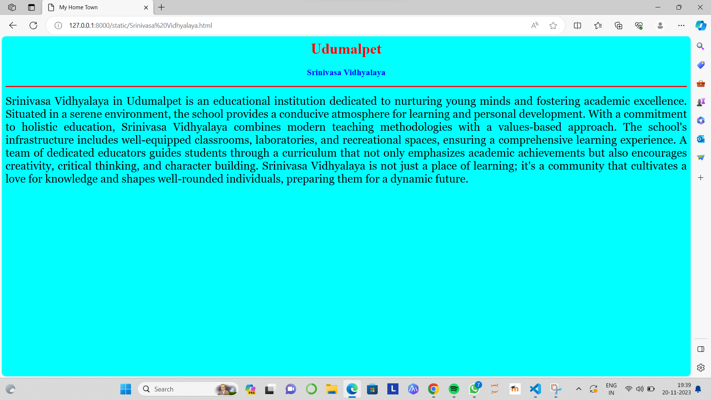
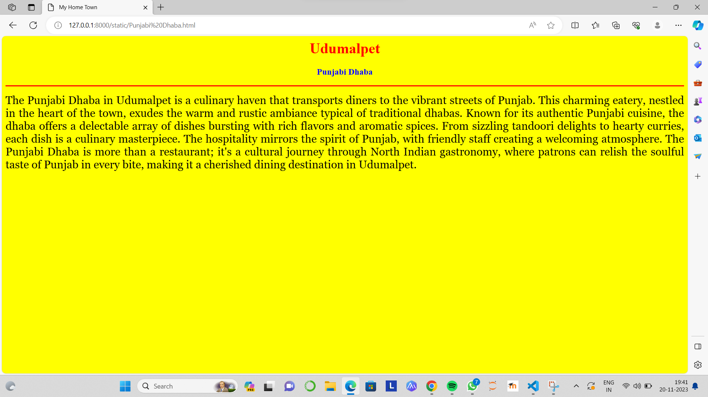
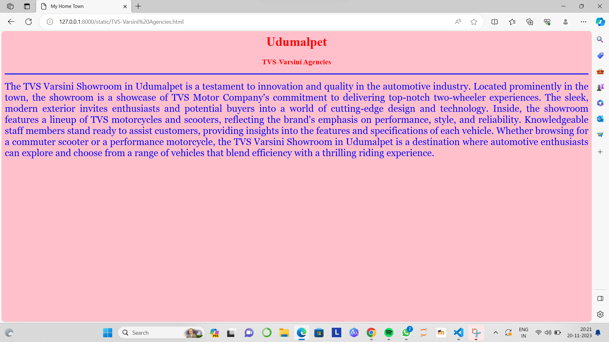

# Ex04 Places Around Me
## Date: 20.11.2023

## AIM
To develop a website to display details about the places around my house.

## DESIGN STEPS

### STEP 1
Create a Django admin interface.

### STEP 2
Download your city map from Google.

### STEP 3
Using ```<map>``` tag name the map.

### STEP 4
Create clickable regions in the image using ```<area>``` tag.

### STEP 5
Write HTML programs for all the regions identified.

### STEP 6
Execute the programs and publish them.

## CODE
```
map.html

<html>
<head>
<title>My City</title>
</head>
<body>
<h1 align="center">
<font color="red"><b>Udumalpet</b></font>
</h1>
<h3 align="center">
<font color="blue"><b>Varshini D (23014071)</b></font>
</h3>
<center>

<map name="MyCity">
<area shape="RECT" coords="330,210,530,250" href="Lathangi Theatre.html" title="Lathangi Theatre">
<area shape="RECT" coords="230,280,350,330" href="Punjabi Dhaba.html" title="Punjabi Dhaba">
<area shape="RECT" coords="980,300,1180,350" href="Srinivasa Vidhyalaya.html" title="Srinivasa Vidhyalaya">
<area shape="RECT" coords="200,450,350,480" href="Sivakani Hospital.html" title="Sivakani Hospital">
<area shape="RECT" coords="1070,470,1300,510" href="TVS-Varsini Agencies.html" title="TVS-Varsini Agencies">
</map>
</center>
</body>
</html>

Lathangi Theatre.html

<html>
<head>
<title>My Home Town</title>
</head>
<body bgcolor="purple">
<h1 align="center">
<font color="cyan"><b>Udumalpet</b></font>
</h1>
<h3 align="center">
<font color="lime"><b>Lathangi Theatre</b></font>
</h3>
<hr size="3" color="red">
<p align="justify">
<font face="Georgia" size="5" color="white">
    Lathangi Theatre in Udumalpet stands as a cinematic gem, seamlessly merging modernity with a rich film culture. Located at the heart of town, its inviting marquee beckons cinephiles to a world of visual delight. The exterior boasts contemporary architecture, setting the stage for the technological marvels within. Inside, patrons are welcomed by a spacious lobby adorned with vibrant movie posters, creating an atmosphere charged with the excitement of cinema. The auditorium, equipped with cutting-edge audio-visual technology and comfortable seating, offers an immersive cinematic experience. Beyond screenings, Lathangi Theatre serves as a cultural hub, hosting special events that bring the community together. With friendly staff, well-maintained facilities, and a commitment to cinematic excellence, Lathangi Theatre in Udumalpet promises not just movies but a communal celebration of storytelling on the silver screen.
</font>
</p>
</body>
</html>

Punjabi Dhaba.html

<html>
<head>
<title>My Home Town</title>
</head>
<body bgcolor="yellow">
<h1 align="center">
<font color="red"><b>Udumalpet</b></font>
</h1>
<h3 align="center">
<font color="blue"><b>Punjabi Dhaba</b></font>
</h3>
<hr size="3" color="red">
<p align="justify">
<font face="Georgia" size="5">
    The Punjabi Dhaba in Udumalpet is a culinary haven that transports diners to the vibrant streets of Punjab. This charming eatery, nestled in the heart of the town, exudes the warm and rustic ambiance typical of traditional dhabas. Known for its authentic Punjabi cuisine, the dhaba offers a delectable array of dishes bursting with rich flavors and aromatic spices. From sizzling tandoori delights to hearty curries, each dish is a culinary masterpiece. The hospitality mirrors the spirit of Punjab, with friendly staff creating a welcoming atmosphere. The Punjabi Dhaba is more than a restaurant; it's a cultural journey through North Indian gastronomy, where patrons can relish the soulful taste of Punjab in every bite, making it a cherished dining destination in Udumalpet.
</font>
</p>
</body>
</html>

Srinivasa Vidhyalaya.html

<html>
<head>
<title>My Home Town</title>
</head>
<body bgcolor="cyan">
<h1 align="center">
<font color="red"><b>Udumalpet</b></font>
</h1>
<h3 align="center">
<font color="blue"><b>Srinivasa Vidhyalaya</b></font>
</h3>
<hr size="3" color="red">
<p align="justify">
<font face="Georgia" size="5">
    Srinivasa Vidhyalaya in Udumalpet is an educational institution dedicated to nurturing young minds and fostering academic excellence. Situated in a serene environment, the school provides a conducive atmosphere for learning and personal development. With a commitment to holistic education, Srinivasa Vidhyalaya combines modern teaching methodologies with a values-based approach. The school's infrastructure includes well-equipped classrooms, laboratories, and recreational spaces, ensuring a comprehensive learning experience. A team of dedicated educators guides students through a curriculum that not only emphasizes academic achievements but also encourages creativity, critical thinking, and character building. Srinivasa Vidhyalaya is not just a place of learning; it's a community that cultivates a love for knowledge and shapes well-rounded individuals, preparing them for a dynamic future.
</font>
</p>
</body>
</html>

Sivakani Hospital.html

<html>
<head>
<title>My Home Town</title>
</head>
<body bgcolor="red">
<h1 align="center">
<font color="yelow"><b>Udumalpet</b></font>
</h1>
<h3 align="center">
<font color="green"><b>Sivakani Hospital</b></font>
</h3>
<hr size="3" color="yellow">
<p align="justify">
<font face="Georgia" size="5" color="white">
    Sivakani Hospital in Udumalpet is a beacon of healthcare, providing comprehensive medical services with a commitment to patient well-being. Nestled in the community, the hospital is synonymous with quality healthcare in the region. The modern facade welcomes patients into a facility equipped with state-of-the-art medical technology and a skilled medical team. From general healthcare services to specialized treatments, Sivakani Hospital caters to diverse medical needs. The hospital's compassionate staff ensures a comforting environment, prioritizing patient care and satisfaction. With a focus on medical excellence and community health, Sivakani Hospital in Udumalpet stands as a trusted healthcare partner, embodying a commitment to healing and promoting the well-being of individuals and families in the local community.
</font>
</p>
</body>
</html>

TVS-Varsini Agencies.html

<html>
<head>
<title>My Home Town</title>
</head>
<body bgcolor="pink">
<h1 align="center">
<font color="red"><b>Udumalpet</b></font>
</h1>
<h3 align="center">
<font color="red"><b>TVS-Varsini Agencies</b></font>
</h3>
<hr size="3" color="blue">
<p align="justify">
<font face="Georgia" size="5" color="blue">
    The TVS Varsini Showroom in Udumalpet is a testament to innovation and quality in the automotive industry. Located prominently in the town, the showroom is a showcase of TVS Motor Company's commitment to delivering top-notch two-wheeler experiences. The sleek, modern exterior invites enthusiasts and potential buyers into a world of cutting-edge design and technology. Inside, the showroom features a lineup of TVS motorcycles and scooters, reflecting the brand's emphasis on performance, style, and reliability. Knowledgeable staff members stand ready to assist customers, providing insights into the features and specifications of each vehicle. Whether browsing for a commuter scooter or a performance motorcycle, the TVS Varsini Showroom in Udumalpet is a destination where automotive enthusiasts can explore and choose from a range of vehicles that blend efficiency with a thrilling riding experience.
</font>
</p>
</body>
</html>
```

## OUTPUT







## RESULT
The program for implementing image maps using HTML is executed successfully.
